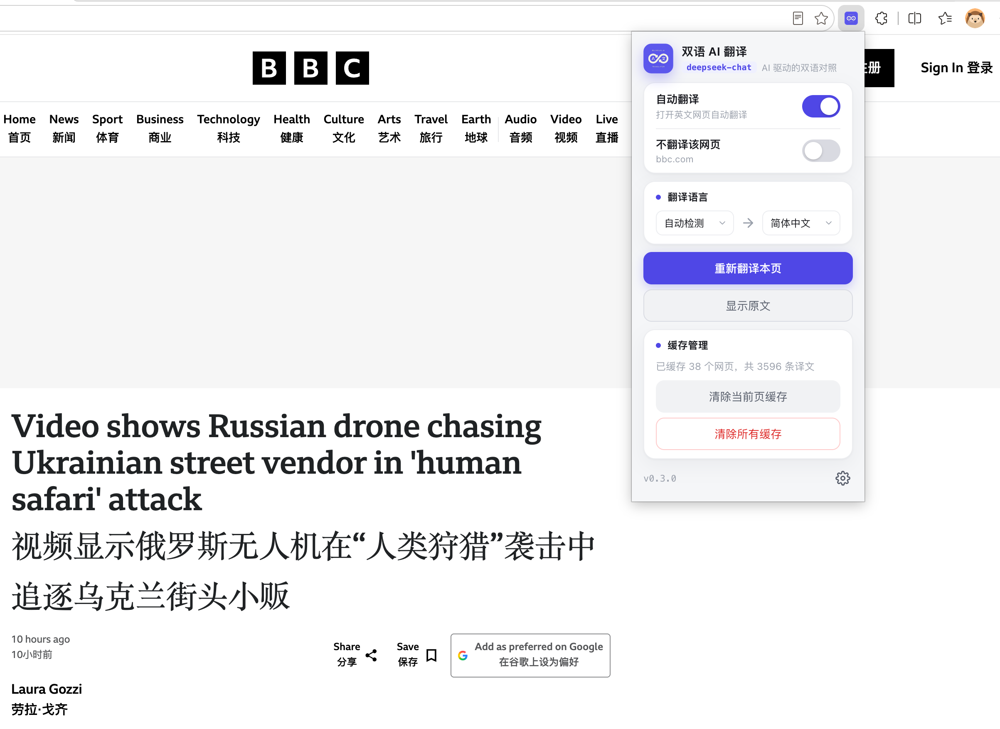
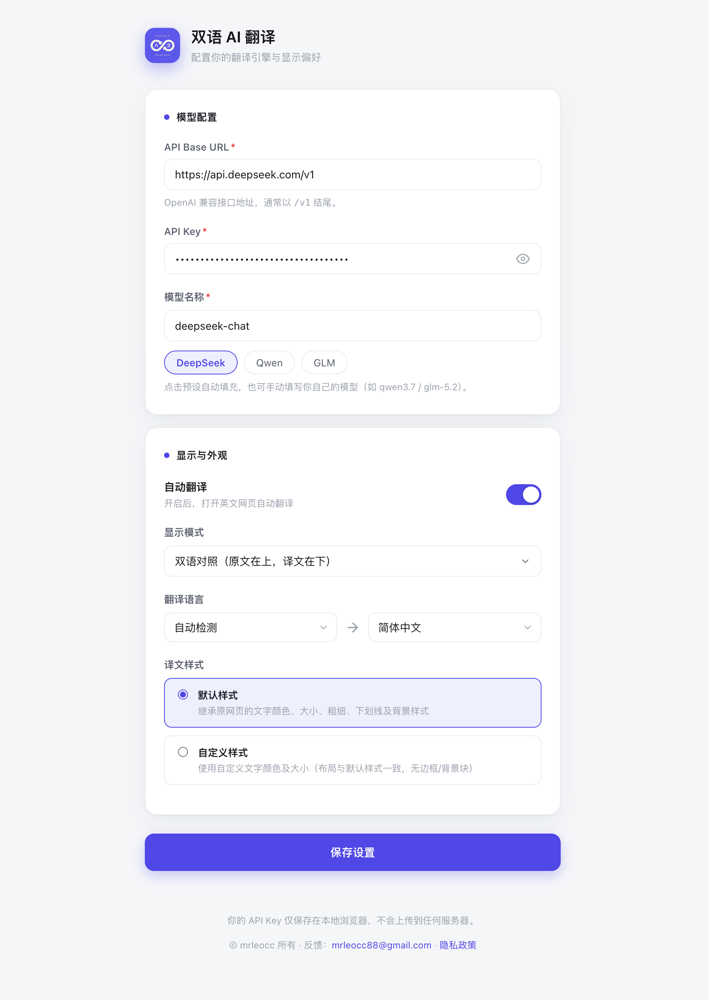

# 双语 AI 翻译

一款 Chrome/Edge 浏览器扩展，利用 AI 自动翻译网页，保留双语对照显示。支持 DeepSeek、Qwen、GLM 以及任何兼容 OpenAI 接口格式的模型服务商。

---

> **[English Version](README.md)**

---

## 功能特性

- **自动翻译** — 打开网页自动翻译，无需手动操作
- **双语对照** — 原文在上、译文在下，逐段对照
- **多种显示模式** — 双语对照 / 仅显示译文，一键切换
- **多语言支持** — 源语言自动检测 + 7 种目标语言（简体中文 / 英语 / 日语 / 韩语 / 西班牙语 / 德语 / 法语）
- **任选 AI 模型** — 兼容任何 OpenAI 接口格式的模型（DeepSeek / Qwen / GLM 等）
- **独立 API Key** — 每个模型可单独保存 API Key，互不干扰
- **翻译缓存** — 自动缓存翻译结果，节省 API 调用，支持逐页/全部清除
- **不翻译该网站** — 按主域名屏蔽（含子域名），如 `news.medium.com` → `medium.com`，屏蔽后该域名下所有页面都不翻译
- **智能域名解析** — 基于 Public Suffix List（psl）精确识别主域名，正确处理 `co.uk` / `com.cn` / `github.io` 等公共后缀
- **SPA 站点支持** — 自动检测单页应用（Medium 等）的路由变化并重新翻译
- **翻译加速** — 并发请求 + 批量翻译，大幅缩短整页翻译耗时
- **自定义样式** — 可调节译文颜色和字号
- **错误提示** — 友好的中文错误信息，弹窗内直接展示

## 界面预览

**弹窗（popup）**

**设置页（options）**

---

## 安装方式

### 从 Chrome Web Store / Edge 加载项安装

*(待发布后补充链接)*

### 开发者模式安装

1. 下载最新发布的 ZIP 包或克隆本仓库
2. 打开 Chrome/Edge 浏览器，访问 `chrome://extensions`（或 `edge://extensions`）
3. 开启右上角的 **开发者模式**
4. 点击 **加载已解压的扩展程序**
5. 选择 `bilingual-translator` 文件夹

---

## 配置说明

### 1. 打开设置页

点击浏览器工具栏中的扩展图标，再点击右下角的齿轮图标。  
或者右键点击扩展图标，选择 **选项**。

### 2. 配置 AI 模型

需要填写三个字段：

| 字段 | 说明 | 示例 |
|------|------|------|
| **API Base URL** | AI 服务商的接口地址（需以 `/v1` 结尾） | `https://api.deepseek.com/v1` |
| **API Key** | 你的 API 密钥 | `sk-...` |
| **模型名称** | 使用的模型标识 | `deepseek-chat` |

点击预设按钮（DeepSeek / Qwen / GLM）可自动填充，也可手动填写其他模型地址。

### 3. 语言设置

- **源语言**：选择「自动检测」或指定一种语言
- **目标语言**：选择要翻译成哪种语言

### 4. 显示偏好

- **自动翻译**：开关自动翻译功能
- **显示模式**：`双语对照`（原文+译文）或 `仅显示译文`
- **译文颜色**：自定义译文字体颜色

---

## 使用方法

### 弹窗操作

| 按钮/开关 | 功能 |
|------|------|
| **重新翻译本页** | 清除当前页面的译文并重新翻译 |
| **显示原文** | 移除译文，并阻止自动重新翻译 |
| **自动翻译开关** | 启用或禁用自动翻译 |
| **不翻译该网站开关** | 屏蔽当前网站主域名（含所有子域名），开启后该域名下所有页面不再翻译 |

> **关于「不翻译该网站」**：开启后按主域名保存（如 `news.medium.com` → `medium.com`），该域名及其所有子域名都不会被翻译。`localhost` / IP 地址按端口独立（`localhost:8137` 与 `localhost:3000` 互不影响）。在不支持扩展的页面（`edge://`、扩展商店等），相关按钮会自动禁用并提示。

### 缓存管理

- **清除当前页缓存** — 删除当前页面的翻译缓存（所有语言对）
- **清除所有缓存** — 删除所有页面的翻译缓存

---

## 支持的语言对

| 源语言 | 目标语言 |
|--------|----------|
| 自动检测 | 🇨🇳 简体中文 |
| 🇬🇧 英语 | 🇬🇧 英语 |
| 🇨🇳 中文 | 🇯🇵 日语 |
| 🇯🇵 日语 | 🇰🇵 韩语 |
| 🇰🇵 韩语 | 🇪🇸 西班牙语 |
| 🇪🇸 西班牙语 | 🇩🇪 德语 |
| 🇩🇪 德语 | 🇫🇷 法语 |
| 🇫🇷 法语 | |

---

## 隐私说明

本扩展**不收集任何个人数据**：

- **API Key** 通过 `chrome.storage.sync` 仅存储在浏览器本地
- **翻译请求** 直接发送到你配置的 AI 服务商，不经任何中间服务器
- **翻译缓存** 存储在浏览器本地，可随时清除
- **无分析统计**、无跟踪、无第三方服务

完整隐私政策请查看：[隐私政策](privacy.html)

**隐私政策在线地址：** [https://26c1a7c0d0164f32a6b689a30a8274f0.app.codebuddy.work/privacy.html](https://26c1a7c0d0164f32a6b689a30a8274f0.app.codebuddy.work/privacy.html)

---

## 技术栈

- Manifest V3
- Chrome Extension API（`storage`、`unlimitedStorage`、`tabs`）
- OpenAI 兼容接口
- 原生 JavaScript（无框架依赖）
- [Public Suffix List](https://publicsuffix.org/)（psl 库，精确域名解析）

---

## 版权与反馈

版权所有 © mrleocc

问题反馈： [mrleocc88@gmail.com](mailto:mrleocc88@gmail.com)
